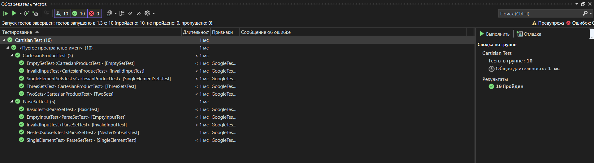

# Лабораторная работа №2. Множества
## Цель работы
- Научиться работать с множествами.
- Научиться разрабатывать алгоритмы выполнения операций над множествами.
## Задачи
- Разработать алгоритм одной из операций над множествами.
- Разработать систему тестов, которые продемонстрировали бы работоспособность реализованного алгоритма.
## Вариант
Мой вариант – вариант 6 [методички](https://drive.google.com/drive/folders/1_xy849HXgTDetxSMlFd0KikTBo8-xalN). Нужно реализовать алгоритм вычисления декртова произведения N множеств.
## Список используемых при решении задачи понятий
- Множество – одно из ключевых понятий математики, представляющее собой набор, совокупность объектов любой природы.
- Элементы множества – объекты, составляющие множество.
- Объект принадлежит множеству тогда и только тогда, когда он является его элементом.
- Говорят, что если объект принадлежит множеству, то существует вхождение этого элемента в множество. Допускается неограниченное количество вхождений
одного объекта в какое-либо множество.
- Например, есть множество _S = {a, b, a, a, c}_. В нём элементы _a_, _b_ и _c_ принадлежат множеству _S_, причём множество _S- Например, есть множество _S = {a, b, a, a, c}_. В нём элементы _a_, _b_ и _c_ принадлежат множеству _S_, причём множество _S_ имеет три вхождения элемента _a_ (_S|a|_ = 3) и по одному вхождению элементов _b_ и _c_ (_S|b|_ = _S|c|_ = 1).
- Множеством с кратными вхождениями элементов называют множество _S_ тогда и только тогда, когда существует _x_ такой, что истинно _S|x|_ > 1._ имеет три вхождения элемента _a_ (_S|a|_ = 3) и по одному вхождению элементов _b_ и _c_ (_S|b|_ = _S|c|_ = 1).
- Множеством с кратными вхождениями элементов называют множество _S_ тогда и только тогда, когда существует _x_ такой, что истинно _S|x|_ > 1.
- _Декартовым произведением_ неориентированных множеств A и B называют
неориентированное множество S тогда и только тогда, когда для любого z истинно: если
S|z| > 0, то z = <x, y>; S|z| = A|x|*B|y| и наоборот.
## Реализация
Поскольку множетва помимо обычных элементов могут в себе содержать еще и подмножества, я создал класс элементов множеств, который создает объекты, а именно элементы множесва. В зависимости от параметра isAtomic это будет подмножество или обычный элемент.
Моя реализация класса на С++

```C++
#ifndef SET_ELEMENT_H
#define SET_ELEMENT_H

#include <string>
#include <vector>

class SetElement {
public:
    bool isAtomic; // true, если это атомарный элемент, false, если множество
    std::string value; // значение, если атомарный элемент
    std::vector<SetElement> subset; // подмножество, если это множество

    SetElement(std::string val) : isAtomic(true), value(val) {}
    SetElement(std::vector<SetElement> elements) : isAtomic(false), subset(elements) {}

    std::string toString() const {
        if (isAtomic) return value;
        std::string result = "{";
        for (size_t i = 0; i < subset.size(); ++i) {
            result += subset[i].toString();
            if (i < subset.size() - 1) result += ",";
        }
        result += "}";
        return result;
    } // для вывода элемента
};

#endif

#endif
```
Что же делать дальше? Все просто, необходимо разработать парсинг для подмножеств(ввод множеств осуществляется в текстовом файле).
Вот мой загаловочный файл парсинга, в котором я объявил функции для парсинга подмножеств и множеств.
```C++
#ifndef SET_PARSER_H
#define SET_PARSER_H

#include "set_element.h"
#include <string>
#include <vector>

std::vector<SetElement> parseSet(const std::string& input);
SetElement parseElement(std::string element);
#endif
```
Далее, в .cpp реализовал все эти функции и также проверял на ошибки ввода
```C++
#include "set_parser.h"
#include "set_element.h"

std::vector<SetElement> parseSet(const std::string& input) {
    std::vector<SetElement> result;
    if (input.empty()) return result; // Пустой ввод — пустой результат

    std::string trimmed = input;
    // Удаляем пробелы для упрощения
    trimmed.erase(std::remove_if(trimmed.begin(), trimmed.end(), isspace), trimmed.end());

    // Проверяем сбалансированность скобок
    int braceCount = 0;
    for (char c : trimmed) {
        if (c == '{') braceCount++;
        if (c == '}') braceCount--;
        if (braceCount < 0) return {}; // Закрывающая скобка без открывающей — ошибка
    }
    if (braceCount != 0) return {}; // Несбалансированные скобки — ошибка

    // Разделяем элементы по запятым вне скобок
    std::string current;
    int depth = 0;
    for (char c : trimmed) {
        if (c == '{') depth++;
        if (c == '}') depth--;
        if (depth < 0) return {}; // Ошибка: лишняя закрывающая скобка
        if (c == ',' && depth == 0) {
            if (!current.empty()) {
                result.push_back(parseElement(current));
                current.clear();
            }
        }
        else {
            current += c;
        }
    }
    if (!current.empty()) {
        result.push_back(parseElement(current));
    }

    return result;
}

// Вспомогательная функция для парсинга одного элемента
SetElement parseElement(std::string element) {
    // Удаляем пробелы
    element.erase(std::remove_if(element.begin(), element.end(), isspace), element.end());

    if (element.empty()) return SetElement(""); // Пустой элемент

    if (element[0] == '{' && element.back() == '}') {
        // Это подмножество
        std::string subsetStr = element.substr(1, element.size() - 2);
        std::vector<SetElement> subset = parseSet(subsetStr);
        return SetElement(subset);
    }
    else {
        // Это атомарный элемент
        return SetElement(element);
    }
}
```
Когда мы провели все приготовления перед декртовым произведением, необходимо наконец-таки реализовать функции для произведения.
Вот мой заголовочный файл, в котором я подключил все необходимые файлы и библиотеки, а также обявил функцию для декртова произведения.
```C++
#ifndef CARTESIAN_PRODUCT_H
#define CARTESIAN_PRODUCT_H

#include "set_element.h"
#include <vector>

std::vector<std::vector<SetElement>> cartesianProduct(const std::vector<std::vector<SetElement>>& sets);

#endif
```
Теперь осталось за малым и вот моя реализация декартова произведения. Здесь мы проверили на некорректность данных и с помощью вложенных циклов проводим декартово произведение.
```C++
#include "cartesian_product.h"

std::vector<std::vector<SetElement>> cartesianProduct(const std::vector<std::vector<SetElement>>& sets) {
    std::vector<std::vector<SetElement>> result;

    // Если входной вектор пуст, возвращаем пустой результат
    if (sets.empty()) return result;

    // Если есть хотя бы одно пустое множество, результат пуст
    for (const auto& set : sets) {
        if (set.empty()) return result;
    }

    // Инициализируем результат первым множеством
    result.reserve(sets[0].size()); // Резервируем место для оптимизации
    for (const auto& element : sets[0]) {
        result.push_back({ element });
    }

    // Строим декартово произведение для остальных множеств
    for (size_t i = 1; i < sets.size(); ++i) {
        std::vector<std::vector<SetElement>> newResult;
        newResult.reserve(result.size() * sets[i].size()); // Оптимизация
        for (const auto& current : result) {
            for (const auto& element : sets[i]) {
                std::vector<SetElement> tuple = current;
                tuple.push_back(element);
                newResult.push_back(std::move(tuple));
            }
        }
        result = std::move(newResult);
    }

    return result;
}
```
Теперь у нас есть работющая функция для вычисления декартова произведения любого количесвта множеств с подмножествами любой вложенности. Я сделал main.cpp который считывает множества из текствого файла и использует далее мои функции.
```C++
#include "set_parser.h"
#include "cartesian_product.h"
#include <iostream>
#include <fstream>

int main() {
    std::ifstream file("sets.txt");
    if (!file.is_open()) {
        std::cout << "Не удалось открыть файл\n";
        return 1;
    }

    std::vector<std::vector<SetElement>> sets;
    std::string line;
    while (std::getline(file, line)) {
        sets.push_back(parseSet(line));
    }
    file.close();

    auto product = cartesianProduct(sets);
    for (const auto& tuple : product) {
        std::cout << "(";
        for (size_t i = 0; i < tuple.size(); ++i) {
            std::cout << tuple[i].toString();
            if (i < tuple.size() - 1) std::cout << ",";
        }
        std::cout << ")\n";
    }

    return 0;
}
```
#Пример работы
Важно! множества не обрамляются фигурными или иными скобками, так как функция для парсинга воспринимает множесво как подмножество.
Данные в текстовом файле:
```txt
1, 2, {a, b}
7, 8
```
Вывод программы:
```txt
(1,7)
(1,8)
(2,7)
(2,8)
({a,b},7)
({a,b},8)
```
Еще один пример. Данные в текстовом файле:
```txt
1, 2, {a, b}
7, 8
1,2,3,{{},{1,3}}
```
Вывод программы:
```txt
(1,7,1)
(1,7,2)
(1,7,3)
(1,7,{{},{1,3}})
(1,8,1)
(1,8,2)
(1,8,3)
(1,8,{{},{1,3}})
(2,7,1)
(2,7,2)
(2,7,3)
(2,7,{{},{1,3}})
(2,8,1)
(2,8,2)
(2,8,3)
(2,8,{{},{1,3}})
({a,b},7,1)
({a,b},7,2)
({a,b},7,3)
({a,b},7,{{},{1,3}})
({a,b},8,1)
({a,b},8,2)
({a,b},8,3)
({a,b},8,{{},{1,3}})
```
Все тесты были успешно пройдены:

## Вывод
В ходе данной лабораторной работы я:
- Научился работать с множествами
- Научиться разрабатывать алгоритмы выполнения операций над множествами.
