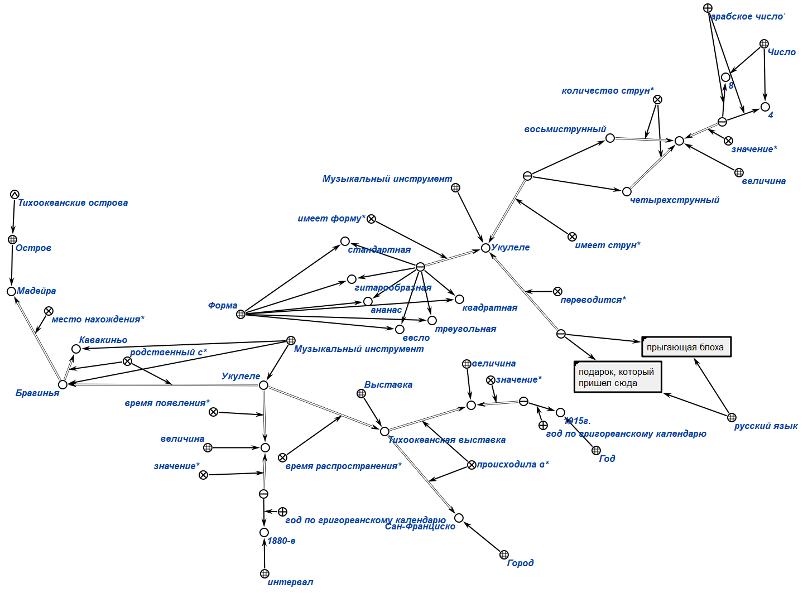
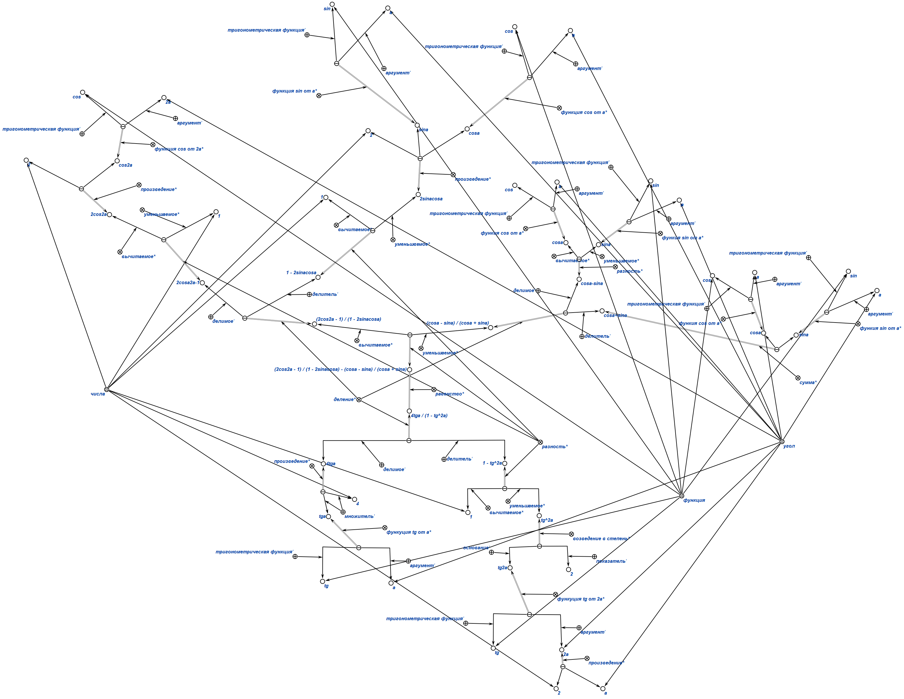

# Формализация текста 
## Вариант 25
### Текст:
  Укулеле — четырёхструнный щипковый музыкальный инструмент, либо же со сдвоенными
струнами, т. е. — восьмиструнный. Появился в 1880-е годы как развитие брагиньи —
миниатюрной гитары с острова Мадейра, родственной португальскому кавакиньо. Укулеле
распространена на различных тихоокеанских островах, со времён гастролей гавайских
музыкантов на Тихоокеанской выставке 1915 года в Сан-Франциско. Название переводится по
одной версии как «прыгающая блоха», по другой — как «подарок, который пришёл сюда».
Гитара укулеле может быть разных форм, как стандартной, гитарообразной, так и формы
«ананас», в форме весла, треугольной формы, квадратной.
  Формализация текста в KBE: 
  
  #Формализация математического выражения
  ## Вариант 15
  ### Выражение: 
  Формализация математического выражения: 
