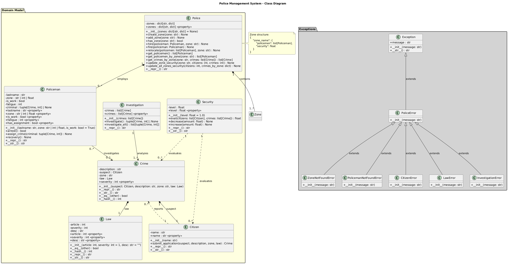
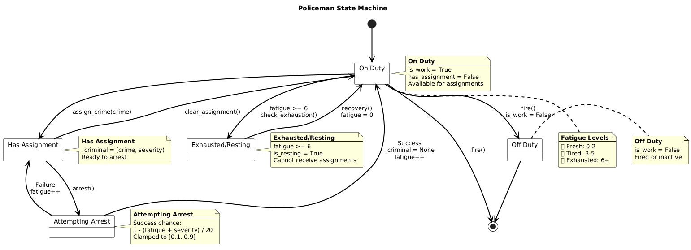
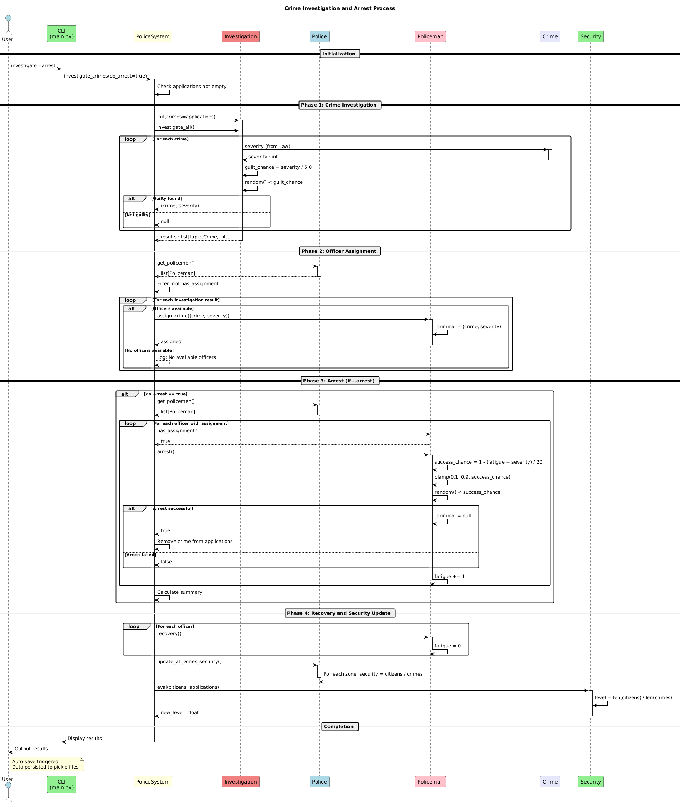

# Police Management System

A command-line application for managing police departments, crime investigations, and public security.

## 📋 Requirements

- Python 3.10+
- No external dependencies required (uses only standard library)
- For UML diagrams: PlantUML

## 🚀 Installation

1. Clone the repository:
```bash
git clone <repository-url>
cd lab1
```

2. (Optional) Create a virtual environment:
```bash
python -m venv .venv
source .venv/bin/activate  # On Windows: .venv\Scripts\activate
```

3. Install development dependencies (for testing):
```bash
pip install pytest
```

## 📖 Usage

### Interactive Mode

Run the application without arguments to enter interactive mode:

```bash
python main.py
```

Example session:
```
police> citizen add John Doe
✓ Citizen 'John Doe' added

police> police add-zone Downtown
✓ Zone 'Downtown' created

police> police hire Smith Downtown
✓ Officer Smith hired to zone Downtown

police> law add 101 3 Theft
✓ Law added: Article 101 (Severity: 3)

police> statement add "Stole a bike" Downtown 0 0
✓ Crime report filed successfully

police> investigate
✓ Investigation result: John Doe is likely guilty

police> save
✓ Data saved successfully

police> exit
Goodbye!
```

### Command-Line Mode

You can also run specific commands directly:

```bash
# Add a citizen
python main.py citizen add "John Doe"

# Add a zone
python main.py police add-zone "Downtown"

# Hire a policeman
python main.py police hire "Smith" "Downtown"

# Add a law
python main.py law add 101 3 "Theft"

# File a crime report
python main.py statement add "Stole a bike" "Downtown" 0 0

# List all crimes
python main.py statement list

# Investigate crimes
python main.py investigate

# Investigate and attempt arrests
python main.py investigate --arrest

# Show history
python main.py history show

# Save and exit
python main.py save
```

## 📁 Project Structure

```
lab1/
├── main.py                 # Main CLI application
├── police/                 # Domain model package
│   ├── __init__.py
│   ├── Police.py          # Police department management
│   ├── Policeman.py       # Police officer class
│   ├── Citizen.py         # Citizen class
│   ├── Crime.py           # Crime class
│   ├── Law.py             # Law/statute class
│   ├── Investigation.py   # Crime investigation logic
│   └── Security.py        # Security level evaluation
├── tests/                  # Unit tests
│   ├── __init__.py
│   └── test_police.py
├── docs/                   # Documentation
│   └── uml/               # UML diagrams (PlantUML)
│       ├── class_diagram.puml
│       ├── state_diagram.puml
│       └── sequence_diagram.puml
├── data/                   # Persistent data storage
├── pyproject.toml         # Project configuration
└── README.md              # This file
```

## 🏛️ Domain Model

### Core Entities

| Entity | Description |
|--------|-------------|
| **Police** | Manages zones and officers |
| **Policeman** | Law enforcement officer |
| **Citizen** | Civilian in the system |
| **Crime** | Criminal offense record |
| **Law** | Legal statute with severity |
| **Investigation** | Crime analysis process |
| **Security** | Public safety evaluation |

### Operations

1. **Crime Investigation** - Analyze crimes and identify suspects
2. **Public Order** - Maintain security through officer deployment
3. **Citizen Interaction** - Accept crime reports from citizens
4. **Crime Prevention** - Monitor and respond to security levels
5. **Arrest Operations** - Apprehend identified criminals

## 🧪 Testing

Run all unit tests:

```bash
pytest
# or
python -m pytest
```

Run with verbose output:

```bash
pytest -v
```

## 📊 UML Diagrams

### Class Diagram
Shows the structure and relationships between all entities.



### State Diagram
Shows the policeman state machine during arrest operations.



### Sequence Diagram
Shows the crime investigation process flow.



### Viewing UML Diagrams

The diagrams are created in PlantUML format (.puml files). To view them:

1. **VS Code Extension**: Install "PlantUML" extension by jebbs
2. **IntelliJ IDEA**: Install "PlantUML Integration" plugin
3. **Online**: Use [PlantText](https://www.planttext.com/)
4. **CLI**: Install PlantUML and run:
   ```bash
   plantuml docs/uml/*.puml
   ```

## 🔧 CLI Commands Reference

### Citizen Commands
| Command | Description |
|---------|-------------|
| `citizen add <name>` | Add a new citizen |
| `citizen delete <index>` | Remove a citizen |
| `citizen list` | Show all citizens |

### Police Commands
| Command | Description |
|---------|-------------|
| `police hire <lastname> <zone>` | Hire an officer |
| `police fire <lastname>` | Fire an officer |
| `police add-zone <zone>` | Create a new zone |
| `police list` | Show all officers |
| `police info` | Show zone details |
| `police relocate <idx...> <zone>` | Move officers |

### Crime Commands
| Command | Description |
|---------|-------------|
| `statement add <desc> <zone> <suspect_idx> <law_idx>` | File report |
| `statement delete <index>` | Remove a report |
| `statement list` | Show all reports |

### Investigation Commands
| Command | Description |
|---------|-------------|
| `investigate` | Analyze crimes |
| `investigate --arrest` | Investigate and arrest |

### Law Commands
| Command | Description |
|---------|-------------|
| `law add <article> <severity> <desc>` | Add a law |
| `law list` | Show all laws |

### System Commands
| Command | Description |
|---------|-------------|
| `history show` | View action history |
| `history clear` | Clear history |
| `save` | Save data |
| `exit` | Save and quit |

## ⚙️ Data Persistence

Data is automatically saved to the `data/` directory in pickle format:

- `police.pkl` - Police department data
- `applications.pkl` - Crime reports
- `history.pkl` - Action history
- `citizens.pkl` - Citizen records
- `laws.pkl` - Legal statutes
- `security.pkl` - Security levels

## 🎯 Key Features

- ✅ **PEP8 Compliant** - Follows Python style guidelines
- ✅ **Type Hints** - Full type annotation throughout
- ✅ **Exception Handling** - Custom exception hierarchy
- ✅ **CLI Interface** - Both interactive and command-line modes
- ✅ **Data Persistence** - State saved between sessions
- ✅ **Unit Tests** - Comprehensive test coverage
- ✅ **UML Documentation** - Class, state, and sequence diagrams
- ✅ **GitHub Ready** - Structured for version control

## 📝 License

This project is created for educational purposes.

## 👨‍💻 Author

Mukhamedzianau Egor

## 📅 Version

0.1.0
